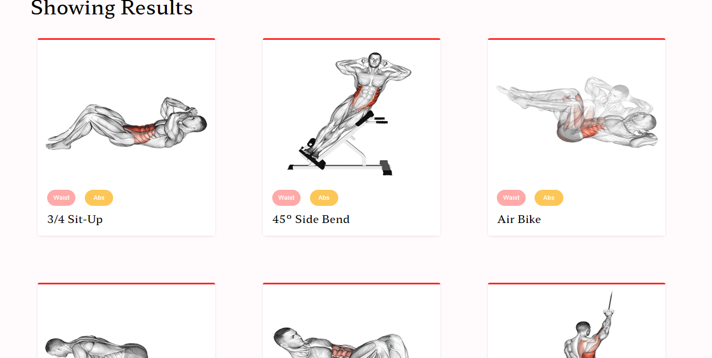

# Exercise App 

# tools and technologies 

## Features: Exercise App

* This app shows more than a thousand of exercises with their video to make you fit .
* It also show related exercises based on your searched exercise with their videos .

## scripts
`npm install` and `npm start`

### [`Check Now`](https://nidhisharma63.github.io/FITNESS-EXERCISE-REACT-APP/)
